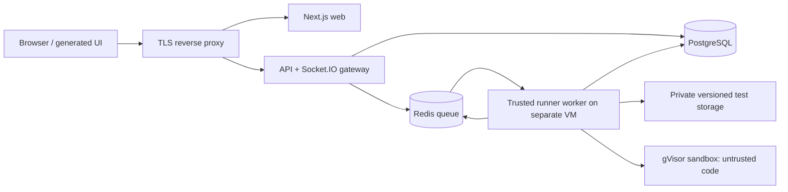

# ArenaCore: architecture and deployment plan

Status: target architecture; the foundation, persistence/API baseline, OIDC identity, durable-job API/database and queue/realtime protocol milestones are now implemented and automatically verified. See README for verified progress. The full system is not implemented or security-certified.
Reviewed: 18 September 2026.

## Requirements and scope

The supplied PDF specifies a browser coding IDE: React, Monaco, draggable split panes, Java/Python/JavaScript, problem descriptions and examples, Run/Submit, live console output, judging, and submission history. PostgreSQL and Socket.IO are chosen from its suggested stack. The PDF is requirements input, not an instruction to execute its embedded implementation steps.

At initial review, the repository contained only a README and the PDF. Backend implementation has since started; the isolated supervisor is now implemented, but dedicated-host acceptance and full judging remain pending. The PDF refers to a previous sandbox specification that was not provided. This plan proposes a security baseline; compliance with that missing specification must be checked when it becomes available.

Resolve the PDF's inconsistent Run lifecycle: Run executes public examples only; Submit executes the versioned public and hidden suites. Hidden inputs, expected answers, user-generated hidden stdout/stderr, and hidden-case diagnostics never reach clients. Keep the authenticated socket alive between jobs. Use REST to create durable jobs and Socket.IO to subscribe to their progress rather than using a socket as the only record of a request. These are intentional architecture changes from the document.

MVP scope: sign-in, problem catalog, workspace, three language runtimes, public Run, private Submit, cancellation, reconnect, and private history. A seeded problem catalog is enough initially. Custom stdin, arbitrary packages, collaborative editing, interactive shells, AI help, competitions, billing, and public leaderboards are outside this MVP.

## Architecture

Use a TypeScript monorepo with a modular API and separately deployed execution worker. Avoid turning every business module into a separate service. The execution boundary requires separate hosts and privileges from the outset.

| Component | Choice | Responsibility |
| --- | --- | --- |
| Web | Next.js App Router, TypeScript, Tailwind, shadcn/ui | UI generated by v0 or Bolt; client-only Monaco; typed API adapter |
| API / realtime gateway | NestJS, REST /api/v1, Socket.IO | Sessions, authorization, problem reads, jobs, history, safe event delivery |
| Database | PostgreSQL, Prisma migrations | Durable jobs, versioned problems/tests, submissions, idempotency, audit events, bounded public replay and worker leases |
| Queue | Redis, BullMQ | ID-only work delivery and queue locks; PostgreSQL owns authoritative worker leases and public replay |
| Runner | Dedicated worker + narrow local supervisor | Compile, run, kill, measure, clean up sandboxes; trusted judge outside user process |
| Execution isolation | OCI runtime with gVisor runsc on dedicated Linux runner VMs | Additional isolation for hostile code; explicit resource and network policies |
| Identity | Managed OIDC provider, API-owned session | Authorization Code + PKCE, secure server-side session; user/admin roles |
| Operations | IaC, container registry, CI, telemetry | Repeatable staging/production, rollout, backup, monitoring |



Trust boundary: user code cannot reach API/DB/Redis/cloud metadata or the worker's credentials. Only the runner supervisor controls the runtime; API and web have no Docker socket or container-create privilege. The runner worker has a restricted service identity and reads only the job/test data it needs. Sandbox processes inherit no worker secrets. Hidden answers stay in the trusted judge; inject only the current test's stdin into user code.

Suggested directories:

```text
apps/web/                  # v0/Bolt frontend export
apps/api/                  # auth, problems, executions, submissions, realtime modules
apps/runner/               # queue consumer and trusted judging
packages/contracts/        # schemas, DTOs, generated API types
packages/runtime-policy/   # server-controlled runtime profiles
infra/                     # IaC, reverse proxy, runner provisioning
runtime-images/            # pinned Java, Python, Node images
```

Versions must be selected, pinned and compatibility-tested during implementation; no floating latest runtime images. Benchmark JVM memory overhead and language-specific timing before finalizing problem limits.

## Data model and judging

- User: provider subject, profile, role; session records stored server-side.
- Problem and immutable ProblemVersion: slug, statement, difficulty, templates, public limits, comparator policy, test-suite version. A job snapshots a version so edits cannot alter a pending submission.
- TestCase: version, ordinal, visibility, input, expected output, limits. Private table/schema and restricted roles; public DTOs use explicit allowlists. Public success rate is calculated from actual data or omitted.
- Execution: owner, mode RUN/SUBMIT, source, language, problemVersion, state, verdict, timestamps, idempotency key, retry attempt, runtime-image digest, aggregate metrics.
- TestResult: execution, visibility, verdict and private judge data. Public serialization filters hidden details even for a job's owner.
- AuditEvent and OutboxEvent: durable admin/security actions and reliable job dispatch. Never store code or hidden tests in general application logs.

Use a stdin/stdout problem convention initially. Java entrypoint is Solution.main, Python is solution.py, JavaScript is solution.js; no third-party dependencies. Compile in isolation too. Source filenames and command argument arrays are server-controlled; never interpolate source into a shell command.

Compile once per job into bounded temporary artifacts; execute each test in a fresh sandbox with only the artifact and that test's stdin. Judge outside the sandbox. Do not execute all hidden tests in one process. Initial comparator: normalize CRLF to LF and permit a single final newline difference; preserve other whitespace. Token/floating-point comparators require explicit per-problem configuration and separate validation. Do not blindly trim all output or use stdout === expected without a defined policy.

Verdicts: ACCEPTED, WRONG_ANSWER, COMPILATION_ERROR, RUNTIME_ERROR, TIME_LIMIT_EXCEEDED, MEMORY_LIMIT_EXCEEDED, OUTPUT_LIMIT_EXCEEDED, CANCELLED, INTERNAL_ERROR. Infrastructure faults are separate from learner failures. Submit exposes aggregate verdict and approved aggregate metrics only; public Run can expose individual public case results.

## Durable execution lifecycle

1. Authenticated POST creates a validated execution with an Idempotency-Key scoped to user and payload. Return 202 with executionId. Persist execution and outbox atomically; publish to the queue from the outbox.
2. Client subscribes to an execution; gateway checks ownership on every subscribe/replay/cancel request. Queue dispatch does not depend on the browser connection.
3. Worker claims a lease with a fencing token, resolves the server-owned runtime and versioned tests, and starts bounded compilation/execution.
4. RUN emits capped public stdout/stderr and public results. SUBMIT emits lifecycle progress only and the sanitized final result. Hidden output must never enter a public event stream or replay store.
5. Commit the authoritative terminal result and final public event in the same transaction; gateway delivery follows that commit. Duplicate deliveries may run again after a failure but only the current fenced attempt can commit; public events also carry the attempt. Terminal states never regress.
6. On reconnect, retrieve REST snapshot and replay public events after the last sequence. Deduplicate by executionId/attempt/sequence. If replay expired, show an output-unavailable notice and restore the snapshot.
7. Cancellation is idempotent. Stage 5 records a durable request; the stage 6 supervisor must kill the full sandbox process tree before acknowledging it. A normal disconnect does not cancel. A janitor removes orphan sandboxes after crashes. Bound queue wait and total job time; expired jobs get a terminal state.

States: QUEUED -> COMPILING -> RUNNING -> FINISHED; active states can transition to CANCELLED or INTERNAL_ERROR. Queue-expired jobs terminate with INTERNAL_ERROR and the safe QUEUE_TIMEOUT code. Stage 4 implements persisted queue deadlines; stage 5 implements dispatch, worker claims, bounded recovery and authenticated public replay. A new attempt can return from running to compiling only after the prior lease expires. A completed job cannot be cancelled retroactively.

## Security baseline and launch gates

Treat all submitted code, statements, and terminal output as untrusted. A container configuration alone is not a complete security claim. gVisor reduces exposure, but host separation, patching, permissions, resource enforcement and adversarial verification remain necessary. See [gVisor production guidance](https://gvisor.dev/docs/user_guide/production/).

Sandbox controls:

- Dedicated runner hosts with no application/database co-location and no inbound public runner endpoint. No privileged containers, host PID/network namespaces, host paths, devices or Docker socket exposed to code.
- gVisor runtime, non-root user, drop all capabilities, no-new-privileges, supported seccomp/LSM hardening verified for the chosen runtime. Read-only root filesystem and size-limited temporary workspace; no writable shared volumes across submissions.
- Network disabled for user processes plus host egress controls. Test DNS, internet, private network and metadata access. No package installation during jobs.
- Enforce cgroup CPU/memory/PID bounds, external wall-clock timeout, file-size/open-file caps, workspace cap, and output-byte cap. Compilation gets its own limits. CPU quota alone does not stop an infinite loop. Docker's resource limits must be configured explicitly: [resource constraints](https://docs.docker.com/engine/containers/resource_constraints/).
- Proposed starting service caps: 64 KiB UTF-8 source, 256 KiB combined output per job, 64 processes per sandbox, 32 MiB scratch space, 15 s compile wall limit, 30 s total execution wall limit. Per-case CPU/memory limits are server-defined and tuned separately for Java/Python/Node. These are candidates to benchmark, not validated production values.
- Cleanup runs on success, failure, timeout, cancellation and worker crash; identify resources by opaque job ID, not user paths. Pre-pull pinned images, scan them and rebuild for security updates.

API/browser controls:

- Secure HttpOnly SameSite sessions; rotate session after sign-in; explicit expiry/revocation; no auth tokens in localStorage. OIDC issuer/audience/state/nonce/PKCE validation is server-owned.
- Route web, `/api/v1` and `/socket.io` through one production origin, or use an exact HTTPS API subdomain under the frontend's registrable domain. Validate browser Origin, authenticate socket handshakes, enforce expiry and per-message authorization, and require CSRF tokens on mutating cookie-authenticated REST requests. Credentialed CORS permits only the configured frontend origin.
- Strict input schemas and byte limits; language enum only; server owns image, paths, limits, test suite and command. Reject unknown fields and client-supplied owner IDs.
- Per-user and per-IP request quotas, job concurrency caps and global queue/runner capacity. Implemented API admission starts at one active job per user, a configurable global unfinished-job cap, and shared user/IP/global successful-creation quotas. Tune from measurements; edge request limits and physical runner capacity remain separate production work. Return actionable 429/503 responses.
- Render console as text; strip dangerous control sequences, cap browser buffers. Sanitize Markdown and disable arbitrary HTML. CSP must accommodate Monaco workers without broad unsafe script allowances.
- Owner checks for every execution/history route and socket room. Admin problem management requires separate RBAC and audit trails; problem authors cannot inject backend commands.
- TLS/WSS, managed secrets, least-privilege database roles, encrypted backups, log redaction, retention policy and deletion procedure. Private submission source never becomes public implicitly.

Socket-specific controls follow [OWASP WebSocket guidance](https://cheatsheetseries.owasp.org/cheatsheets/WebSocket_Security_Cheat_Sheet.html). Do not assume Socket.IO reconnect makes delivery durable: [delivery guarantees](https://socket.io/docs/v4/delivery-guarantees/) require application-managed persistence/replay.

Threat verification before public execution:

- Infinite loops, fork bombs, memory exhaustion, output flooding, scratch exhaustion, compiler abuse and escaping child processes terminate within configured bounds.
- Filesystem, network, metadata and cross-job access attempts fail. Confirm actual cgroup/runtime behavior rather than just checking configuration files.
- A hostile hidden submission that prints its stdin or stack traces does not leak those bytes via events, REST, logs or history. Hidden expected answers are absent from the sandbox.
- A second user cannot read/subscribe/cancel another user's job. Expired sessions lose socket access. Cross-origin and oversized messages are rejected.
- Worker death, duplicate queue delivery, Redis disconnect, cancellation race and browser reconnect recover without duplicate committed results or orphan sandboxes.
- Independent security review of the runner boundary is a launch gate. Reconcile the missing earlier security specification before claiming it is met.

## API contract for frontend generation

Base: /api/v1; cookie credentials included; mutations include X-CSRF-Token. API errors: {error: {code, message, requestId, retryAfterSeconds?}}. Use generated types from packages/contracts when the backend exists.

- GET /me -> {user: {id, displayName, avatarUrl?} | null, csrfToken?}
- GET /problems?difficulty=&search=&cursor= -> {items: ProblemSummary[], nextCursor: string | null}
- GET /problems/:slug -> ProblemDetail (public statement, constraints, examples, limits, templates; never private tests).
- POST /executions + Idempotency-Key -> {executionId, state} (new jobs QUEUED; matching retries return current durable state); body {problemId, language: 'java'|'python'|'javascript', mode: 'RUN'|'SUBMIT', sourceCode}.
- GET /executions/:id -> owner-authorized ExecutionSnapshot.
- POST /executions/:id/cancel -> {executionId, state}; safe on repeat.
- GET /submissions?problemId=&cursor= -> owner history, SUBMIT mode only, with paginated summary rows.
- OIDC flow uses browser navigation to /api/v1/auth/login; sign-out POST /api/v1/auth/logout.

Socket.IO namespace /executions, default transport path /socket.io:

Client execution:subscribe {executionId, afterSequence?, attempt?}; ack {ok: true, replayAvailable: boolean} or {ok: false, error: {code, message}}.

Server events:
- execution_status {executionId, attempt, sequence, state}
- console_output {executionId, attempt, sequence, stream: 'stdout'|'stderr', text} — RUN only.
- final_verdict {executionId, attempt, sequence, verdict, runtimeMs?, memoryKiB?, publicCaseResults?}

Each publicCaseResult has {caseId, verdict, stdout?, stderr?, exitCode?, runtimeMs?, memoryKiB?}. Public case data appears only in RUN snapshots/events; SUBMIT snapshots/events omit it. Compiler diagnostics before private test execution may be exposed after scrubbing worker paths and secrets. Hidden runtime diagnostics are not compiler diagnostics and must stay private. Missing metrics are omitted, not fabricated as zero. Socket sequence numbers order public events per attempt; persist enough metadata to identify the current attempt.

## Delivery phases and acceptance gates

| Phase | Work | Gate |
| --- | --- | --- |
| 0: Contract and threat design | Confirm stdin/stdout convention, identity provider, budgets, missing security spec; schemas and runtime policy | Contract and threat model reviewed; no unresolved public-launch security requirements |
| 1: Frontend handoff | Generate UI using one prompt; export code; review dependencies and accessibility | Catalog/workspace/history work with deterministic mocks; no hidden data or backend implementation in UI |
| 2: Backend foundation | Monorepo, API, OIDC sessions, PostgreSQL migrations, seeded problems, versioned tests, ownership | Real login, filtered public DTOs, owner-isolated history and schema validation pass |
| 3: Job and realtime pipeline | Durable creation/outbox, BullMQ, leases, replay, cancellation; fake worker first | Retry, reconnect, queue failure and terminal-state tests pass |
| 4: Secure runner and judge | gVisor provisioning, three pinned runtime images, isolated compilation/test execution, comparators | Functional judging and adversarial sandbox suite pass for every language |
| 5: UI integration | Replace mock adapter with real REST/Socket.IO adapter | End-to-end Run/Submit/cancel/reconnect/history pass; hidden output remains private |
| 6: Production readiness | IaC, CI/CD, staging, load tests, security review, backup/restore and runbooks | All launch gates pass; rollback and restore demonstrated |

UI generation and backend foundation can proceed concurrently after the contract is established. Backend implementation is owned here; v0/Bolt produce frontend only. Estimates depend on hosting, traffic and security review; do not promise a production-ready date from a UI prototype.

## Deployment design

Start with managed PostgreSQL and Redis, a long-lived API service, a Next.js web service, and a separate Linux runner VM pool supporting runsc and enforceable cgroups. One runner VM can serve a restricted beta, but it is a capacity and availability bottleneck. Scale workers independently by queue depth and observed execution duration. Kubernetes is optional later, not required for the first release.

The initial Oracle free-tier deployment reuses one PostgreSQL server for Watchtower and ArenaCore while assigning ArenaCore a separate database and login. ArenaCore's API and Redis use their own containers; Caddy reaches the API only through the external `watchtower_backend` Docker network. The runner remains on a separate VM and reaches database/queue ports through the Oracle private network only. This saves memory at the cost of a shared database failure domain; backups and restore drills must cover both application databases.

Use a TLS reverse proxy to route one public origin to web, API and Socket.IO. A frontend hosting service may serve the UI, but untrusted code execution and a persistent Socket.IO server need suitable separate infrastructure. Verify the provider permits execution workloads and the required runtime/kernel controls before choosing it.

Stage 5 uses WebSocket-only transport and independent PostgreSQL event polling per gateway, so it needs no relay adapter or long-poll affinity. If a later implementation uses room broadcasts across processes, configure an adapter, and add sticky sessions if HTTP long-polling is enabled; a Redis queue is not itself a Socket.IO adapter. See [multi-node guidance](https://socket.io/docs/v4/using-multiple-nodes/). Durable public replay is still application-managed.

Separate dev/staging/production databases, queues, credentials and runners. Local Compose can run API/DB/Redis and UI; localhost container judging is development only unless all production isolation gates are proven.

CI: lockfile install, formatting/lint, TypeScript, unit tests for state machine/comparators, API integration tests, browser end-to-end tests, dependency/image scans, secret scan, production builds and infrastructure validation. Runner adversarial tests run in isolated disposable staging hosts, not a generic CI worker with shared credentials.

Release: build signed/pinned artifacts; apply backward-compatible migrations; deploy staging and smoke-test; promote API/web; drain old runner jobs before replacing images; monitor errors and queue latency; roll back application versions while keeping compatible schemas. Destructive migrations require a separate staged procedure.

Operations: health/readiness endpoints, request IDs, job/attempt correlation, queue age, active sandboxes, cleanup failures, resource kills, error rates and socket reconnect metrics. Alert on saturation and cleanup failures. Set cost/concurrency ceilings and an emergency execution-disable switch while preserving read access. PostgreSQL automated backups with restore drills; Redis loss must be recoverable from durable executions/outbox and reconciled leases. Propose a beta restore objective of 4 hours and a data-loss objective of 15 minutes, subject to selected backup capabilities and tested recovery.

Public-launch checklist: HTTPS and session controls; no runner secrets exposed; hidden data filtering verified; runtime isolation and limits tested; scans/review passed; restore/rollback exercised; saturation behavior measured; retention and abuse handling documented. Host separation and test success reduce risk; they do not establish that sandbox escape is impossible.

## Decisions still needed

The previous sandbox security specification, cloud/provider and monthly budget, expected concurrency, preferred sign-in provider, and whether problem authoring needs an admin UI. These do not block frontend generation or the foundational design. Public launch cannot claim compliance with a specification that has not been supplied.
