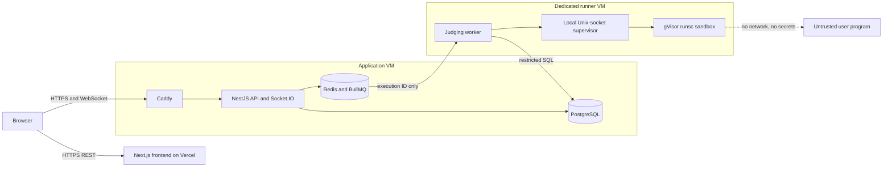
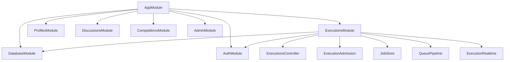
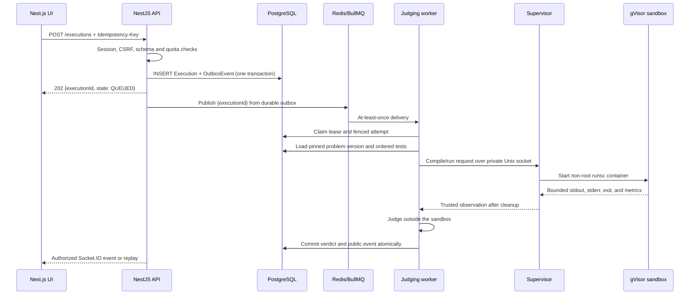
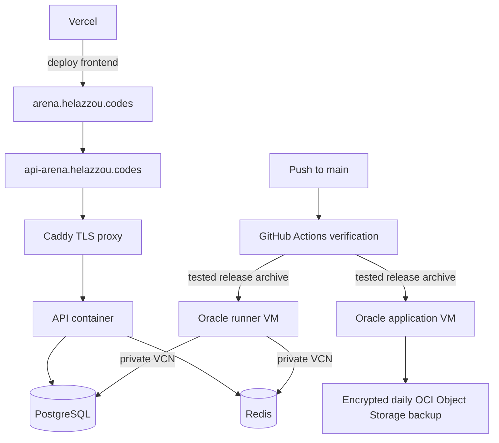

# ArenaCore architecture interview guide

This guide is a speaking aid. Do not memorize it word for word. Understand the
reason behind each boundary, then explain the system as a sequence of decisions.

## The strongest opening

### Thirty-second version

> ArenaCore is an online judge and competitive-programming platform. The frontend is
> a Next.js application, while a modular NestJS API owns identity, authorization,
> problems, competitions, submissions, and realtime delivery. PostgreSQL is the
> source of truth. Redis and BullMQ transport execution identifiers to a separate
> worker VM. That worker sends narrow requests to a local supervisor, which runs
> untrusted Java, Python, and JavaScript inside non-root gVisor sandboxes with no
> network and strict cgroup limits. The key architectural decision is separating the
> public control plane from the hostile-code execution plane.

### Two-minute version

> I designed ArenaCore around two different workloads. The control plane is a normal
> web application: authentication, problem data, profiles, discussions, competitions,
> submission creation, authorization, and realtime updates. The execution plane is
> different because it runs attacker-controlled code. I therefore kept the business
> backend as a modular NestJS monolith, but put execution on a separate Oracle VM with
> gVisor, a narrow systemd service identity, and private-network-only access.
>
> A submission is first validated and persisted in PostgreSQL together with an outbox
> event in one transaction. A dispatcher publishes only the execution ID to BullMQ.
> The runner claims a database lease with an attempt number, loads the immutable
> problem version and tests, and executes every case in a fresh sandbox. PostgreSQL,
> rather than Redis or a WebSocket connection, owns the authoritative lifecycle and
> terminal verdict. Socket.IO is used for fast delivery, while persisted public events
> support replay after reconnects.
>
> The design handles duplicate queue delivery, browser disconnects, worker crashes,
> cancellation races, hidden-test confidentiality, and malicious submissions. I chose
> a modular monolith for business features because the team and traffic do not justify
> microservices, while extracting the runner because that boundary is justified by
> security and independent scaling.

## Start with the problem, not the frameworks

The interesting problem is not rendering an editor or storing a submission. It is:

1. Accept code from an untrusted user.
2. Execute it without exposing the application, database, cloud metadata, or another
   user's submission.
3. Produce a correct verdict even when messages are duplicated or machines fail.
4. Show live progress without making the browser connection the source of truth.
5. Keep hidden test data and expected answers outside all public projections.

This framing gives the architecture a reason. Every component should answer one of
these problems.

## System context

The public API VM and runner VM are in the same Oracle VCN. PostgreSQL and Redis accept
runner traffic only from the runner's private IP. The runner has no public application
endpoint. SSH is an operational channel, not part of the judging protocol.

## Architectural style

ArenaCore uses a **modular monolith plus an isolated execution service**.

The NestJS API stays one deployable process but has modules for:

- Authentication and sessions
- Problems and immutable problem versions
- Executions, admission, durable jobs, and realtime delivery
- Profiles and leaderboards
- Discussions and moderation
- Competitions and ownership
- Administration and auditing

This provides clear code ownership and dependency boundaries without paying the
operational cost of many services. The runner is separate because it needs different
host privileges, kernel controls, scaling, failure handling, and security assumptions.

An effective interview sentence is:

> I split by trust boundary and operational behavior, not by entity name.

## How NestJS works in this project

NestJS builds an application graph from modules. Each module declares its imported
modules, controllers, providers, and exported providers.

### Controllers

Controllers translate HTTP into application calls. They declare routes, validate the
request shape, obtain the authenticated principal, and return a deliberately safe DTO.
They should not contain the durable job algorithm or judging logic.

### Providers and dependency injection

Providers contain reusable application behavior. Nest creates them and injects their
dependencies through constructors. For example, execution services receive the
database, configuration, admission service, and job store instead of creating global
connections themselves.

This gives three practical benefits:

1. Dependencies are explicit in constructors.
2. Tests can replace a provider, such as the OIDC gateway or execution backend.
3. Connection lifecycle and singleton scope are controlled centrally.

### Guards

`SessionGuard` resolves the opaque cookie to a server-side session. On mutations it
also checks the exact browser origin and CSRF token. `RolesGuard` adds database-owned
role authorization for administration. A provider's role claim cannot turn a user
into an ArenaCore administrator.

### Pipes and schema validation

ArenaCore uses strict Zod schemas at external boundaries. Unknown fields are rejected.
This matters because the client is not allowed to choose owner IDs, Docker commands,
runtime images, filesystem paths, test limits, or hidden-test visibility.

### Lifecycle hooks

The queue pipeline uses Nest lifecycle hooks to start its bounded maintenance loop
after application bootstrap and to close timers and Redis clients during shutdown.
The judging worker is deliberately a different process and is never imported by the
HTTP bootstrap.

### Exception filter

The global exception filter maps internal failures to stable error codes and request
IDs. It avoids returning stack traces, database messages, request bodies, source code,
or provider secrets.

### Why NestJS was useful

NestJS provides a consistent structure for a backend that has many cross-cutting
concerns: authentication, CSRF, RBAC, validation, configuration, lifecycle management,
and realtime gateways. Its value here is predictable composition and test replacement,
not decorators by themselves.

## Submission lifecycle

### 1. Admission and idempotency

The API validates the language, mode, source byte size, owner, problem availability,
and competition timing. It applies per-user, per-IP, global creation, and active-job
limits. The `Idempotency-Key` is scoped to the user and request payload. Retrying the
same action returns the existing execution; reusing the key for a different payload is
rejected.

### 2. Transactional outbox

The execution row and outbox intent are created in the same PostgreSQL transaction.
This prevents the dual-write failure where the database commits but queue publication
is lost, or the queue contains a job with no database record.

The dispatcher claims outbox rows with `FOR UPDATE SKIP LOCKED`, publishes an
ID-only message, and acknowledges publication using a dispatch token. Failed
publication receives bounded exponential backoff.

### 3. PostgreSQL is authoritative

Redis is fast transport. It is not the system of record. The execution state machine,
attempt number, lease, public replay, cancellation request, and terminal verdict live
in PostgreSQL. If Redis loses queue data, maintenance can reconstruct delivery from
durable state.

### 4. At-least-once delivery and fencing

BullMQ can redeliver work after failures. ArenaCore does not pretend the queue is
exactly once. A worker must claim a lease tied to an attempt. Every heartbeat, event,
and terminal update is conditional on that lease. A delayed worker from an expired
attempt cannot overwrite the current result.

Use this sentence:

> Exactly-once delivery is unrealistic here, so I built idempotent creation and
> fenced, exactly-once terminal commitment on top of at-least-once delivery.

### 5. Trusted judging

The worker loads the immutable problem version and ordered tests. Expected answers
remain in trusted memory and never enter the user container. The sandbox returns an
observation: exit code, stdout, stderr, timeout and resource counters. The trusted
judge converts that observation into a verdict.

`RUN` executes public examples and may return bounded public output. `SUBMIT` uses the
versioned public and hidden suite but exposes only the aggregate safe verdict and
approved metrics.

### 6. Realtime and reconnect

Socket.IO improves latency but does not own job state. Subscription checks ownership.
Public events have execution ID, attempt, and sequence. After reconnect, the client
loads the REST snapshot and requests events after its last sequence. If replay has
expired, the final snapshot still restores authoritative state.

### 7. Cancellation and crashes

Cancellation is a durable request. The system does not claim success until the
supervisor has killed and verified removal of the sandbox process tree. Heartbeats
detect lost workers. Expired leases can create a new recovery attempt. A separate
janitor removes orphaned managed containers after abrupt worker or supervisor death.

## Runner security boundary

User code is assumed malicious.

### Host separation

The runner is on a dedicated VM. The public API does not have a Docker socket. The
runner does not serve a public HTTP endpoint. Its supervisor listens on a private Unix
socket and accepts a narrow validated protocol.

### Sandbox controls

Each untrusted execution uses:

- `runsc` through gVisor
- A pinned image digest for Java, Python, or JavaScript
- A non-root UID/GID
- Dropped Linux capabilities and `no-new-privileges`
- A read-only root filesystem
- A fresh, capacity-bounded scratch area
- No network namespace connectivity
- No Docker socket, host paths, devices, database credentials, or cloud credentials
- CPU, memory, PID, output, file, and wall-clock bounds
- Forced cleanup followed by absence verification

Compilation is also untrusted and receives its own sandbox and deadline. This is
important because compilers parse attacker-controlled input.

### Defense in depth

Docker namespaces are one layer. gVisor provides a userspace kernel boundary. The
dedicated VM limits the effect of a runtime escape. Oracle NSGs and host firewall
rules restrict network paths. Least-privilege database grants limit the worker even if
its process is compromised.

Avoid saying "containers make it secure." Say:

> Isolation is defense in depth, and its behavior is verified adversarially on the
> actual ARM64 production kernel and runtime.

### Security evidence

The live runner suite checks all three languages plus infinite loops, memory pressure,
PID exhaustion, output flooding, scratch exhaustion, network and metadata denial,
read-only filesystems, missing secrets, cancellation, cleanup, and test-to-test
isolation. Host verification records the `runsc` and manifest hashes.

## Authentication and browser security

ArenaCore supports native email/password authentication and direct Google and GitHub
login. Native passwords use a unique salt and memory-hard `scrypt`. Social flows use
state, a browser-bound single-use transaction, PKCE, exact callbacks, signed OIDC token
verification where applicable, and no persisted provider tokens.

Successful methods produce the same application session:

- The browser receives an opaque `Secure`, `HttpOnly`, `SameSite=Lax` cookie.
- Only the SHA-256 token hash is stored in PostgreSQL.
- Sessions expire, can be revoked, rotate on login, and are capped per user.
- Mutations require an exact frontend origin and a per-session CSRF token.
- Credentialed CORS accepts only the configured frontend origin.
- RBAC is stored in ArenaCore, never accepted from Google, GitHub, or Auth0 claims.

Public DTOs are allowlists. Provider subjects, password hashes, session records,
source code, hidden cases, and private diagnostics are absent unless a narrowly
authorized internal operation needs them.

## Problem and test design

A `Problem` points to a published immutable `ProblemVersion`. A version owns its
statement, difficulty, templates, input mode, limits, comparator policy, and test
cases. Executions pin the version ID, so editing a problem later cannot change a job
already in the queue.

Tests may use standard input or bounded server-defined files. File names are validated
against traversal and collision rules. Each case receives fresh scratch storage, so a
submission cannot communicate with the next case through leftover files.

Publication is a domain boundary. PostgreSQL triggers prevent published versions and
test suites from being silently rewritten. An edit creates a new version.

## Frontend architecture

The frontend uses Next.js App Router and a typed API adapter. Monaco runs client-side.
Runtime response validators treat the backend response as untrusted input even though
TypeScript types exist at build time.

The workspace separates:

- Problem statement and public examples
- Per-problem, per-language local drafts
- Language template selection
- REST command creation and cancellation
- Socket.IO progress and replay
- Bounded, text-only console rendering
- Private submission history

The frontend never receives database credentials, provider client secrets, hidden
tests, expected hidden answers, or the runner protocol.

## Deployment architecture

The application VM hosts Caddy, the API, Redis, and a shared PostgreSQL container with
separate ArenaCore and Watchtower databases. This saves free-tier memory but creates a
shared database failure domain. The runner VM hosts systemd-managed worker,
supervisor, janitor, Docker, and gVisor.

CI verifies schema, migrations, TypeScript, integration tests, and security-relevant
contracts before deployment. Releases use immutable commit directories and a `current`
symlink. The database is backed up daily at midnight UTC, encrypted with `age`, uploaded
through an OCI instance principal, and tested through disposable restore drills.

## Reliability principles worth emphasizing

### Make durable state explicit

Browser connections, Redis messages, and worker processes are temporary. PostgreSQL
stores the facts needed to recover.

### Model state transitions

Execution transitions are constrained in application code and PostgreSQL. Terminal
jobs cannot regress to active states, and immutable request fields cannot be rewritten.

### Distinguish learner failures from infrastructure failures

A wrong answer or runtime error is a learner verdict. A lost sandbox, invalid cgroup
measurement, queue timeout, or uncertain cleanup is an infrastructure failure. The
platform must not blame the learner for its own failure.

### Prefer safe degradation

If realtime delivery fails, REST snapshots still work. If Redis loses data, durable
outbox/recovery state can republish. If measurement is unavailable, metrics are omitted
rather than invented. If cleanup cannot be proven, cancellation is not reported as
successful.

## Testing strategy

The project uses several layers:

1. Unit tests for schemas, judging, output comparison, transport, and state rules.
2. PostgreSQL integration tests for migrations, constraints, transactions, RBAC,
   idempotency, quotas, and authorization.
3. Redis/BullMQ pipeline tests for duplicate delivery, leases, recovery, replay, and
   cancellation races.
4. OIDC and native-auth tests with controlled providers and real sessions.
5. Live gVisor integration tests on the runner host.
6. Acceptance scripts for worker lifecycle, crash recovery, metrics, security posture,
   live judging, backups, and restore.

The strongest testing point is that security controls are tested behaviorally. The
project does not only inspect a Docker configuration; it runs hostile workloads and
verifies the outcome.

## Design choices and tradeoffs

### Why PostgreSQL plus Redis?

PostgreSQL provides transactions, constraints, durable ownership, replay, and recovery.
Redis/BullMQ provides low-latency work delivery. Assigning each system one role avoids
using Redis as a database or PostgreSQL as a busy polling queue.

### Why a modular monolith?

Business domains share transactions and are maintained by one project. A modular
monolith is easier to deploy, test, and refactor at this stage. The runner is separate
because its security and scaling characteristics are truly different.

### Why gVisor instead of plain Docker?

Plain containers share the host kernel. gVisor reduces direct kernel attack surface.
It costs some performance, which is acceptable for the initial workload and can be
calibrated into language-specific limits.

### Why not Kubernetes yet?

Two small VMs do not justify its operational complexity. The design already has
immutable images, health checks, isolated workers, queues, and stateless API behavior,
so orchestration can be introduced when capacity or availability requires it.

### Why Socket.IO if PostgreSQL is authoritative?

Realtime transport improves experience; durable state provides correctness. These are
different responsibilities.

### Current compromises

- A single runner VM is a capacity and availability bottleneck.
- PostgreSQL is shared at the container-host level with another application.
- The free-tier deployment has limited redundancy.
- Some operational alerting and production load evidence should grow with traffic.
- gVisor reduces risk but does not replace patching and independent security review.

Naming these limits demonstrates engineering judgment. Do not claim the system is
infinitely scalable or formally secure.

## Scaling plan

1. Add runner VMs first because execution is the expensive workload. BullMQ already
   distributes work, and fencing protects duplicate attempts.
2. Move PostgreSQL to a managed or dedicated service with tested point-in-time recovery.
3. Move Redis to a managed, private service if queue availability becomes important.
4. Run multiple stateless API gateways. Keep PostgreSQL replay authoritative; add a
   dedicated cross-node Socket.IO adapter only if the delivery topology requires it.
5. Add queue-depth, wait-time, runtime-percentile, lease-recovery, and capacity-based
   autoscaling signals.
6. Introduce Kubernetes only when the operational benefit exceeds its cost.

## Questions an interviewer may ask

### What happens if the API crashes after accepting a submission?

The execution and outbox event are committed atomically. A later dispatcher can still
publish the job. The browser can fetch the execution snapshot using its ID.

### What happens if Redis accepts a job but the worker runs it twice?

Delivery is at least once. A worker must acquire the current database lease and attempt.
Only mutations carrying that fencing identity can append events or commit a result.

### What happens if the worker dies while code is running?

Heartbeats stop, the lease expires, recovery creates a new attempt, and the supervisor
or independent janitor removes orphaned managed sandboxes. The stale worker is fenced
from committing later.

### How do you prevent hidden-test leakage?

Expected output stays in the trusted judge. The sandbox sees only its current input
files or stdin. Submit-mode serializers and event schemas omit per-case output. Logs do
not record source, hidden inputs, expected answers, or backend exception details.

### Why is a Docker container insufficient?

It still shares the host kernel. ArenaCore adds gVisor, a separate VM, a non-root user,
capability removal, no network, read-only filesystems, cgroups, pinned images, narrow
credentials, cleanup verification, and adversarial tests.

### How do you prevent one user from reading another submission?

The server derives the user from the session and includes owner conditions in every
snapshot, history, replay, cancellation, and Socket.IO subscription lookup. Client
owner IDs are rejected.

### How do you change a published problem safely?

Published versions and test suites are immutable. Editing creates another version.
Existing executions keep their pinned version, while the problem can point new users
to the newly published version.

### How do you protect cookie authentication?

Opaque HttpOnly cookies prevent JavaScript token access. SameSite, exact-origin CORS,
origin checks, and per-session CSRF tokens protect mutations. Server-side records allow
revocation and expiry.

### What would you improve with more time or budget?

Add redundant runner capacity, move stateful services to managed private offerings,
improve telemetry and alerts, perform independent runner review, add load tests tied to
capacity targets, and automate disaster-recovery timing evidence.

## A five-minute whiteboard order

Draw in this order:

1. Browser and Next.js frontend.
2. Caddy and NestJS API.
3. PostgreSQL below the API and label it "source of truth."
4. Redis beside it and label it "ID-only transport."
5. A large trust-boundary line.
6. Worker and supervisor on a second VM.
7. gVisor sandbox inside that VM.
8. Arrows for REST, outbox, queue, lease, supervisor request, and realtime result.

While drawing, explain failure behavior on each arrow. That gives more interview value
than listing technologies.

## Suggested live demonstration

1. Sign in and open one problem.
2. Run a public example and point out public case output.
3. Submit a correct and incorrect solution and show the private history.
4. Refresh during an execution to demonstrate snapshot/replay recovery.
5. Show the database execution state and outbox concept without exposing source.
6. Show the runner security evidence and a blocked network/metadata test.
7. Show the CI checks and immutable deployed release path.

## Phrases that communicate senior reasoning

- "The queue transports intent; the database owns truth."
- "The WebSocket is a delivery optimization, not a consistency boundary."
- "I chose at-least-once delivery plus idempotency and fencing."
- "I extracted the runner because the trust boundary justified a separate service."
- "Hidden data is prevented by construction through allowlisted projections."
- "A cancellation is complete only after cleanup is proven."
- "Published problem versions are immutable, so pending work is reproducible."
- "I test effective isolation behavior on the production kernel, not only configuration."

## Claims to avoid

Do not say:

- "Docker makes arbitrary code completely secure."
- "BullMQ gives exactly-once processing."
- "WebSockets guarantee event delivery."
- "The free-tier deployment is highly available."
- "The system can scale infinitely."
- "Passing tests proves there are no vulnerabilities."

Say what is implemented, what is verified, and what remains a tradeoff.

## Final interview structure

When asked to present the project, use this sequence:

1. **Problem:** safely judge hostile code and deliver live feedback.
2. **Boundary:** control plane versus execution plane.
3. **Correctness:** PostgreSQL truth, transactional outbox, idempotency, leases, fencing.
4. **Security:** separate VM, gVisor, least privilege, no network, hidden-data policy.
5. **User experience:** Next.js, Monaco, REST commands, Socket.IO progress and replay.
6. **Operations:** CI/CD, private VCN, immutable releases, encrypted backups and restore.
7. **Tradeoffs:** single runner and shared free-tier stateful host today; independent
   scaling and managed services later.

That order shows that the frameworks follow the engineering problem rather than drive it.
